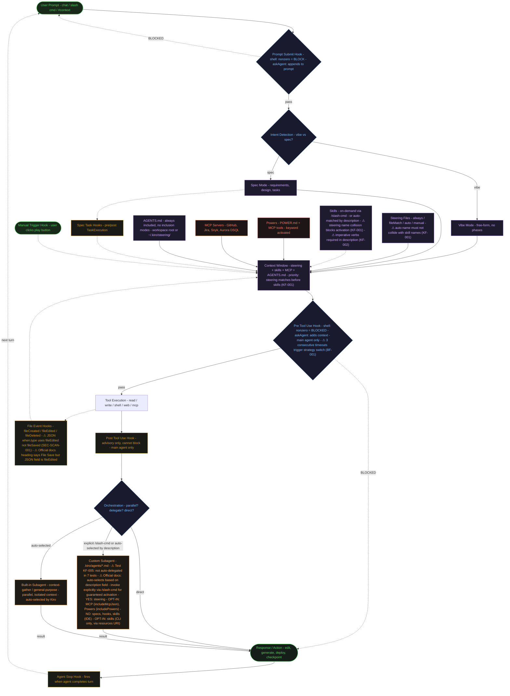

# Kiro IDE - Complete Feature Workflow Diagram

English | [中文](kiro-workflow-diagram.zh-CN.md)

## Key: What Can Block?

| Hook Type | Can Block? | Cost | Mechanism |
|-----------|-----------|------|-----------|
| Prompt Submit (shell) | YES — nonzero exit | Free | Blocks user prompt submission |
| Prompt Submit (askAgent) | NO — appends to prompt | Credits | "Add to prompt" — combined prompt sent to agent |
| Pre Tool Use (shell) | YES — nonzero exit | Free | Blocks the tool invocation |
| Pre Tool Use (askAgent) | NO — adds context | Credits | Advisory context before tool runs |
| Post Tool Use | NO — advisory only | Credits if askAgent | Cannot block; adds context after tool runs |
| File Events (Created/Edited/Deleted) | NO | Credits if askAgent | Triggers on workspace file changes |
| Spec Task Hooks (Pre/Post) | NO | Depends | Pre: before task → in_progress; Post: after task → completed |
| Agent Stop | NO | Depends | Fires when agent completes its turn |
| Manual Trigger | NO | Depends | User clicks ▷ play button in Agent Hooks panel |

All hooks fire in main agent only. Never inside subagents.

Source: [Kiro Hook Actions docs](https://kiro.dev/docs/hooks/actions/) — "If the command returns any other exit code [...] in the case of the Pre Tool Use hook, the tool invocation is blocked, and for the Prompt Submit hook, the user prompt submission is blocked."

## Subagent Inheritance

| Element | Built-in Subagents | Custom Subagents (.kiro/agents/*.md) | Source |
|---------|-------------------|--------------------------------------|--------|
| Steering | YES | YES | [Official docs](https://kiro.dev/docs/chat/subagents/): "Steering files and MCP servers work in subagents exactly as they do in the main agent" |
| MCP Servers | YES (inferred from general statement) | Opt-in via `includeMcpJson: true` (default: false) | General statement covers all subagents; attribute table applies to custom only |
| Powers | YES (inferred) | Opt-in via `includePowers: true` (default: false) | [Official docs](https://kiro.dev/docs/chat/subagents/): attribute table shows default false |
| Hooks | NO | NO | [Official docs](https://kiro.dev/docs/chat/subagents/): "Hooks will not trigger in subagents" |
| Specs | NO | NO | [Official docs](https://kiro.dev/docs/chat/subagents/): "subagents do not have access to Specs" |
| Skills | NO (IDE mode) | NO (IDE mode); Opt-in via `resources: ["skill://..."]` in CLI mode | Root README Subagent Inheritance table; CLI-only URI scheme ([Issue #3](https://github.com/timwukp/Kiro-SDLC-Scrum-best-practics/issues/3)) |

## Test-Verified Findings (from Issue #1 — v3.1.0-final)

### KF-001 — CRITICAL: Steering/Skill Name Collision Blocks Skill Activation

When an `auto` steering file has the same `name` field as a skill, the steering matches first and Kiro skips skill activation entirely. This reveals a priority order in the context window: **steering name match takes precedence over skill name match**.

- `architecture-standards.md` had `name: architecture-review` → collided with `/architecture-review` skill
- `backlog-standards.md` had `name: backlog-management` → collided with `/backlog-management` skill
- Fix: steering `name` must not match any skill name. Convention: use filename as name.

### KF-002 — MEDIUM: Gerund Descriptions Activate Less Reliably

Skill descriptions starting with gerund forms ('Reviewing...', 'Creating...') fail to trigger activation. Imperative verbs work reliably.

- ❌ "Enforcing coding standards..."
- ✅ "Validate Java and TypeScript code against banking naming conventions"

### KF-003 — MEDIUM: Non-Existent Artifact Prompts Prevent Activation

Prompts referencing files that don't exist in the workspace (e.g., "Review this React UI component") cause Kiro to ask for the file instead of activating the skill. Use checklist/planning mode prompts instead.

### KF-005 — INFORMATIONAL: Kiro Did Not Auto-Delegate in Testing (Contradicts Official Docs)

Across 7 tests covering builder, reviewer, scanner, auditor, reader, and runner agent types, Kiro never auto-delegated to a custom subagent. It either:
1. Handled directly with main agent
2. Activated a skill instead
3. Activated a Kiro built-in skill (e.g., frontend-design)
4. Invoked Context Gatherer (built-in)

**However, the official docs explicitly state:** "When launching subagents, Kiro will automatically select the appropriate custom agent configuration for each subagent, based on the `description` field." ([source](https://kiro.dev/docs/chat/subagents/#invocation))

**Possible explanations for the discrepancy:**
- The test workspace was config-only (no source files) — Kiro may need real code context to trigger auto-delegation
- The test prompts may not have been complex enough to trigger subagent delegation
- Auto-selection may depend on the model or Kiro version

**Recommendation:** Use explicit `/slash-cmd` invocation for guaranteed activation. Auto-selection based on description is documented but was not observed in testing.

### BF-001 — Agentic Loop Error Recovery

When Pre Tool Use hook scripts timeout 3 consecutive times, Kiro:
1. Recognizes the timeout pattern
2. Switches strategy (e.g., file write → chat output)
3. Invokes Context Gatherer to re-gather files
4. Produces output via alternative path

This is reactive error-handling (like try/catch), not metacognition. Credit impact: ~50% increase with retries (3.01 vs 2.02 credits).

### SEC-SCAN-001 — `fileSaved` is Invalid JSON Event Type

In the `.kiro.hook` JSON config, the correct `when.type` value is `fileEdited`, not `fileSaved`. Both repos had `compliance-review.kiro.hook` using the invalid `fileSaved` type.

Note: The official Kiro docs heading says "File Save" for the trigger type description, but the actual JSON config field value must be `fileEdited`. This is a naming inconsistency between the docs UI and the config schema.

## Steering Inclusion Modes

| Mode | When Loaded | Requires | Example Files (from repo) |
|------|-------------|----------|--------------------------|
| `always` | Every conversation | No extra config | product.md, tech.md, structure.md, security-policy.md |
| `auto` | When topic matches description | `name` + `description` in frontmatter; ⚠ name must not collide with skill names | compliance-mas-trm.md, architecture-standards.md, deployment-workflow.md, sre-runbook.md, backlog-standards.md, scrum-devsecops.md, pipeline-standards.md |
| `fileMatch` | When matching files are in context | `fileMatchPattern` (string or array) in frontmatter | api-standards.md, database-standards.md, frontend-standards.md, testing-standards.md |
| `manual` | When user provides via # context key | `inclusion: manual` in frontmatter | User-selected steering files |

`auto` and `manual` steering files also appear as slash commands in chat.

### Steering Scope (Global vs Workspace)

| Scope | Location | Priority | Use Case |
|-------|----------|----------|----------|
| Workspace | `.kiro/steering/` | Higher (overrides global) | Project-specific standards |
| Global | `~/.kiro/steering/` | Lower | Cross-project conventions |
| Team | `~/.kiro/steering/` (via MDM/Group Policy) | Lower | Organization-wide standards |

Source: [Official docs](https://kiro.dev/docs/steering/#steering-file-scope): "In case of conflicting instructions between global and workspace steering, Kiro will prioritize the workspace steering instructions."

### AGENTS.md

AGENTS.md files are always included and do not support inclusion modes. They can be placed in:
- Workspace root folder (e.g., `your-project/AGENTS.md`)
- Global steering location (`~/.kiro/steering/`)

Source: [Official docs](https://kiro.dev/docs/steering/#agentsmd): "AGENTS.md files do not support inclusion modes and are always included."

## Hook Inventory (Both Repos)

### Phase-Based SDLC (10 hooks)

| Hook | Trigger | Action | Blocks? |
|------|---------|--------|---------|
| Block Prod Writes | Pre Tool Use (write) | Shell | Yes |
| Credential Guard | Pre Tool Use (write) | Shell | Yes |
| DB Write Guard | Pre Tool Use (shell, @aurora-dsql) | Shell | Yes |
| Coding Standard Guard | Pre Tool Use (write) | Shell | Yes |
| Data Residency Guard | Pre Tool Use (write) | Shell | Yes |
| Compliance Review | File Edited (src/**) | Agent Prompt | No |
| Security Audit | Manual Trigger | Agent Prompt | No |
| Test Coverage Gate | Post Task Execution | Shell | No |
| Post-Batch Sync | Agent Stop | Shell | No |
| Prompt Scope Audit | Agent Stop | Shell | No |

### Sprint-Based DevSecOps (10 hooks)

| Hook | Trigger | Action | Blocks? |
|------|---------|--------|---------|
| Block Prod Writes | Pre Tool Use (write) | Shell | Yes |
| Credential Guard | Pre Tool Use (write) | Shell | Yes |
| DB Write Guard | Pre Tool Use (shell, @aurora-dsql) | Shell | Yes |
| Data Residency Guard | Pre Tool Use (write) | Shell | Yes |
| Security Self-Heal Check | Post Tool Use (write) | Agent Prompt | No |
| Compliance Review | File Edited (src/**) | Agent Prompt | No |
| Security Audit (Manual) | Manual Trigger | Agent Prompt | No |
| Test Coverage Gate | Post Task Execution | Shell | No |
| Sprint Status Sync | Agent Stop | Shell | No |
| Prompt Scope Audit | Agent Stop | Shell | No |

## Tool Matching in Pre/Post Tool Use Hooks

| Pattern | Matches | Source |
|---------|---------|--------|
| `read` | All built-in file read tools | [Official docs](https://kiro.dev/docs/hooks/types/) |
| `write` | All built-in file write tools | Official docs |
| `shell` | All built-in shell command tools | Official docs |
| `web` | All built-in web tools | Official docs |
| `spec` | All built-in spec tools | Official docs |
| `*` | All tools (built-in and MCP) | Official docs |
| `@mcp` | All MCP tools | Official docs |
| `@powers` | All Powers tools | Official docs |
| `@builtin` | All built-in tools | Official docs |
| `@mcp.*sql.*` | Regex match on MCP tool names | Official docs: "Prefixes starting with @ are matched by regex" |

## Verification Sources

| Source | Date Verified | Key Data Points |
|--------|--------------|-----------------|
| [kiro.dev/docs/hooks](https://kiro.dev/docs/hooks/) | 2026-03-29 | Hook types, actions, blocking behavior |
| [kiro.dev/docs/hooks/types](https://kiro.dev/docs/hooks/types/) | 2026-03-29 | 10 trigger types, tool matching patterns |
| [kiro.dev/docs/hooks/actions](https://kiro.dev/docs/hooks/actions/) | 2026-03-29 | Shell blocking (nonzero exit), askAgent cost, Prompt Submit "Add to prompt" |
| [kiro.dev/docs/chat/subagents](https://kiro.dev/docs/chat/subagents/) | 2026-03-29 | Inheritance table, includeMcpJson/includePowers defaults, no Specs/Hooks |
| [Issue #1 test report](https://github.com/timwukp/Kiro-SDLC-Scrum-best-practics/issues/1) | 2026-03-29 | KF-001~005, BF-001, SEC-SCAN-001, 934 assertions, 96.47% pass |
| phase-based-sdlc repo | 2026-03-29 | 13 steering, 14 agents, 15 skills, 10 hooks, 8 scripts |
| sprint-based-devsecops repo | 2026-03-29 | 17 steering, 15 agents, 14 skills, 10 hooks, 7 scripts |
