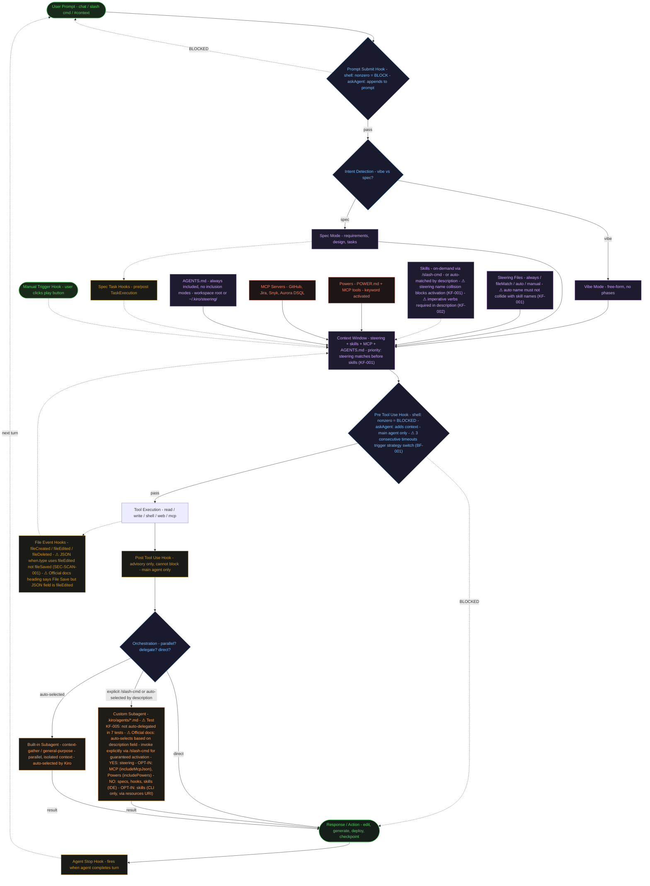

# Kiro IDE — 完整功能工作流程圖

[English](kiro-workflow-diagram.md) | 中文

## 哪些 Hook 可以阻擋操作？

| Hook 類型 | 可阻擋？ | 費用 | 機制 |
|-----------|---------|------|------|
| Prompt Submit (shell) | 是 — nonzero exit | 免費 | 阻擋使用者提交的 prompt |
| Prompt Submit (askAgent) | 否 — 附加到 prompt | Credits | "Add to prompt" — 合併後送給 agent |
| Pre Tool Use (shell) | 是 — nonzero exit | 免費 | 阻擋工具呼叫 |
| Pre Tool Use (askAgent) | 否 — 加入上下文 | Credits | 工具執行前的建議性上下文 |
| Post Tool Use | 否 — 僅建議 | askAgent 時消耗 Credits | 無法阻擋；工具執行後加入上下文 |
| File Events (Created/Edited/Deleted) | 否 | askAgent 時消耗 Credits | 工作區檔案變更時觸發 |
| Spec Task Hooks (Pre/Post) | 否 | 視情況 | Pre: task → in_progress 前；Post: task → completed 後 |
| Agent Stop | 否 | 視情況 | Agent 完成回合時觸發 |
| Manual Trigger | 否 | 視情況 | 使用者點擊 Agent Hooks 面板的 ▷ 按鈕 |

所有 Hook 只在主 agent 中觸發，不會在 subagent 內觸發。

來源：[Kiro Hook Actions 官方文件](https://kiro.dev/docs/hooks/actions/) — "If the command returns any other exit code [...] in the case of the Pre Tool Use hook, the tool invocation is blocked, and for the Prompt Submit hook, the user prompt submission is blocked."

## Subagent 繼承規則

| 元素 | 內建 Subagent | 自訂 Subagent (.kiro/agents/*.md) | 來源 |
|------|--------------|-----------------------------------|------|
| Steering | 是 | 是 | [官方文件](https://kiro.dev/docs/chat/subagents/)："Steering files and MCP servers work in subagents exactly as they do in the main agent" |
| MCP Servers | 是（從通用描述推斷） | 需啟用 `includeMcpJson: true`（預設 false） | 通用描述涵蓋所有 subagent；屬性表僅適用於自訂 subagent |
| Powers | 是（推斷） | 需啟用 `includePowers: true`（預設 false） | [官方文件](https://kiro.dev/docs/chat/subagents/)：屬性表顯示預設為 false |
| Hooks | 否 | 否 | [官方文件](https://kiro.dev/docs/chat/subagents/)："Hooks will not trigger in subagents" |
| Specs | 否 | 否 | [官方文件](https://kiro.dev/docs/chat/subagents/)："subagents do not have access to Specs" |
| Skills | 否（IDE 模式） | 否（IDE 模式）；CLI 模式可透過 `resources: ["skill://..."]` 啟用 | Root README Subagent 繼承表；CLI 專用 URI scheme（[Issue #3](https://github.com/timwukp/Kiro-SDLC-Scrum-best-practics/issues/3)） |

## 測試驗證發現（來自 Issue #1 — v3.1.0-final）

### KF-001 — 嚴重：Steering/Skill 名稱衝突導致 Skill 無法啟動

當 `auto` steering 檔案的 `name` 欄位與 skill 名稱相同時，steering 優先匹配，Kiro 會完全跳過 skill 啟動。這揭示了 context window 中的優先順序：**steering 名稱匹配優先於 skill 名稱匹配**。

- `architecture-standards.md` 原本 `name: architecture-review` → 與 `/architecture-review` skill 衝突
- `backlog-standards.md` 原本 `name: backlog-management` → 與 `/backlog-management` skill 衝突
- 修正方式：steering 的 `name` 不可與任何 skill 名稱相同。慣例：使用檔名作為 name。

### KF-002 — 中等：動名詞描述的啟動可靠性較低

Skill 描述以動名詞開頭（'Reviewing...'、'Creating...'）時，觸發啟動的成功率較低。祈使句動詞可靠觸發。

- ❌ "Enforcing coding standards..."
- ✅ "Validate Java and TypeScript code against banking naming conventions"

### KF-003 — 中等：引用不存在的檔案會阻止 Skill 啟動

當 prompt 引用工作區中不存在的檔案（例如 "Review this React UI component"）時，Kiro 會要求提供檔案而非啟動 skill。應改用 checklist/planning 模式的 prompt。

### KF-005 — 資訊性：測試中 Kiro 未自動委派（與官方文件描述不同）

在涵蓋 builder、reviewer、scanner、auditor、reader、runner 等 agent 類型的 7 次測試中，Kiro 從未自動委派給自訂 subagent。它的行為是：
1. 由主 agent 直接處理
2. 改為啟動 skill
3. 啟動 Kiro 內建 skill（例如 frontend-design）
4. 呼叫 Context Gatherer（內建 subagent）

**但官方文件明確指出：** "When launching subagents, Kiro will automatically select the appropriate custom agent configuration for each subagent, based on the `description` field."（[來源](https://kiro.dev/docs/chat/subagents/#invocation)）

**差異的可能解釋：**
- 測試工作區僅包含設定檔（無原始碼）— Kiro 可能需要真實的程式碼上下文才能觸發自動委派
- 測試 prompt 可能不夠複雜，未達到觸發 subagent 委派的門檻
- 自動選擇可能取決於模型版本或 Kiro 版本

**建議：** 使用明確的 `/slash-cmd` 呼叫以確保啟動。基於 description 的自動選擇是官方文件記載的功能，但在測試中未觀察到。

### BF-001 — Agentic Loop 錯誤恢復

當 Pre Tool Use hook 腳本連續超時 3 次時，Kiro 會：
1. 識別超時模式
2. 切換策略（例如從寫檔改為 chat 輸出）
3. 呼叫 Context Gatherer 重新收集檔案
4. 透過替代路徑產生輸出

這是反應式錯誤處理（類似 try/catch），不是後設認知。Credits 影響：重試時約增加 50%（3.01 vs 2.02 credits）。

### SEC-SCAN-001 — `fileSaved` 是無效的 JSON 事件類型

在 `.kiro.hook` JSON 設定中，正確的 `when.type` 值是 `fileEdited`，不是 `fileSaved`。兩個 repo 的 `compliance-review.kiro.hook` 都使用了無效的 `fileSaved` 類型。

注意：Kiro 官方文件的標題寫 "File Save"，但實際 JSON 設定欄位值必須是 `fileEdited`。這是文件 UI 與設定 schema 之間的命名不一致。

## Steering 載入模式

| 模式 | 何時載入 | 需要設定 | 範例檔案（來自 repo） |
|------|---------|---------|---------------------|
| `always` | 每次對話 | 無需額外設定 | product.md, tech.md, structure.md, security-policy.md |
| `auto` | 當話題匹配描述時 | frontmatter 中需要 `name` + `description`；⚠ name 不可與 skill 名稱衝突 | compliance-mas-trm.md, architecture-standards.md, deployment-workflow.md, sre-runbook.md, backlog-standards.md, scrum-devsecops.md, pipeline-standards.md |
| `fileMatch` | 當匹配的檔案在上下文中 | frontmatter 中需要 `fileMatchPattern`（字串或陣列） | api-standards.md, database-standards.md, frontend-standards.md, testing-standards.md |
| `manual` | 使用者透過 # 上下文鍵提供時 | frontmatter 中需要 `inclusion: manual` | 使用者選擇的 steering 檔案 |

`auto` 和 `manual` steering 檔案也會顯示為 chat 中的 slash 命令。

### Steering 作用範圍（全域 vs 工作區）

| 範圍 | 位置 | 優先順序 | 用途 |
|------|------|---------|------|
| 工作區 | `.kiro/steering/` | 較高（覆蓋全域） | 專案特定標準 |
| 全域 | `~/.kiro/steering/` | 較低 | 跨專案慣例 |
| 團隊 | `~/.kiro/steering/`（透過 MDM/Group Policy） | 較低 | 組織層級標準 |

來源：[官方文件](https://kiro.dev/docs/steering/#steering-file-scope)："In case of conflicting instructions between global and workspace steering, Kiro will prioritize the workspace steering instructions."

### AGENTS.md

AGENTS.md 檔案永遠載入，不支援 inclusion 模式。可放置於：
- 工作區根目錄（例如 `your-project/AGENTS.md`）
- 全域 steering 位置（`~/.kiro/steering/`）

來源：[官方文件](https://kiro.dev/docs/steering/#agentsmd)："AGENTS.md files do not support inclusion modes and are always included."

## Hook 清單（兩個 Repo）

### Phase-Based SDLC（10 個 hooks）

| Hook | 觸發條件 | 動作 | 可阻擋？ |
|------|---------|------|---------|
| Block Prod Writes | Pre Tool Use (write) | Shell | 是 |
| Credential Guard | Pre Tool Use (write) | Shell | 是 |
| DB Write Guard | Pre Tool Use (shell, @aurora-dsql) | Shell | 是 |
| Coding Standard Guard | Pre Tool Use (write) | Shell | 是 |
| Data Residency Guard | Pre Tool Use (write) | Shell | 是 |
| Compliance Review | File Edited (src/**) | Agent Prompt | 否 |
| Security Audit | Manual Trigger | Agent Prompt | 否 |
| Test Coverage Gate | Post Task Execution | Shell | 否 |
| Post-Batch Sync | Agent Stop | Shell | 否 |
| Prompt Scope Audit | Agent Stop | Shell | 否 |

### Sprint-Based DevSecOps（10 個 hooks）

| Hook | 觸發條件 | 動作 | 可阻擋？ |
|------|---------|------|---------|
| Block Prod Writes | Pre Tool Use (write) | Shell | 是 |
| Credential Guard | Pre Tool Use (write) | Shell | 是 |
| DB Write Guard | Pre Tool Use (shell, @aurora-dsql) | Shell | 是 |
| Data Residency Guard | Pre Tool Use (write) | Shell | 是 |
| Security Self-Heal Check | Post Tool Use (write) | Agent Prompt | 否 |
| Compliance Review | File Edited (src/**) | Agent Prompt | 否 |
| Security Audit (Manual) | Manual Trigger | Agent Prompt | 否 |
| Test Coverage Gate | Post Task Execution | Shell | 否 |
| Sprint Status Sync | Agent Stop | Shell | 否 |
| Prompt Scope Audit | Agent Stop | Shell | 否 |

## Pre/Post Tool Use Hook 的工具匹配模式

| 模式 | 匹配範圍 | 來源 |
|------|---------|------|
| `read` | 所有內建檔案讀取工具 | [官方文件](https://kiro.dev/docs/hooks/types/) |
| `write` | 所有內建檔案寫入工具 | 官方文件 |
| `shell` | 所有內建 shell 命令工具 | 官方文件 |
| `web` | 所有內建 web 工具 | 官方文件 |
| `spec` | 所有內建 spec 工具 | 官方文件 |
| `*` | 所有工具（內建 + MCP） | 官方文件 |
| `@mcp` | 所有 MCP 工具 | 官方文件 |
| `@powers` | 所有 Powers 工具 | 官方文件 |
| `@builtin` | 所有內建工具 | 官方文件 |
| `@mcp.*sql.*` | 以 regex 匹配 MCP 工具名稱 | 官方文件："Prefixes starting with @ are matched by regex" |

## 驗證來源

| 來源 | 驗證日期 | 關鍵數據 |
|------|---------|---------|
| [kiro.dev/docs/hooks](https://kiro.dev/docs/hooks/) | 2026-03-29 | Hook 類型、動作、阻擋行為 |
| [kiro.dev/docs/hooks/types](https://kiro.dev/docs/hooks/types/) | 2026-03-29 | 10 種觸發類型、工具匹配模式 |
| [kiro.dev/docs/hooks/actions](https://kiro.dev/docs/hooks/actions/) | 2026-03-29 | Shell 阻擋（nonzero exit）、askAgent 費用、Prompt Submit "Add to prompt" |
| [kiro.dev/docs/chat/subagents](https://kiro.dev/docs/chat/subagents/) | 2026-03-29 | 繼承表、includeMcpJson/includePowers 預設值、無 Specs/Hooks |
| [Issue #1 測試報告](https://github.com/timwukp/Kiro-SDLC-Scrum-best-practics/issues/1) | 2026-03-29 | KF-001~005、BF-001、SEC-SCAN-001、934 條斷言、96.47% 通過率 |
| phase-based-sdlc repo | 2026-03-29 | 13 steering、14 agents、15 skills、10 hooks、8 scripts |
| sprint-based-devsecops repo | 2026-03-29 | 17 steering、15 agents、14 skills、10 hooks、7 scripts |
